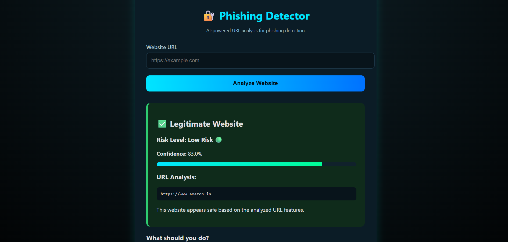
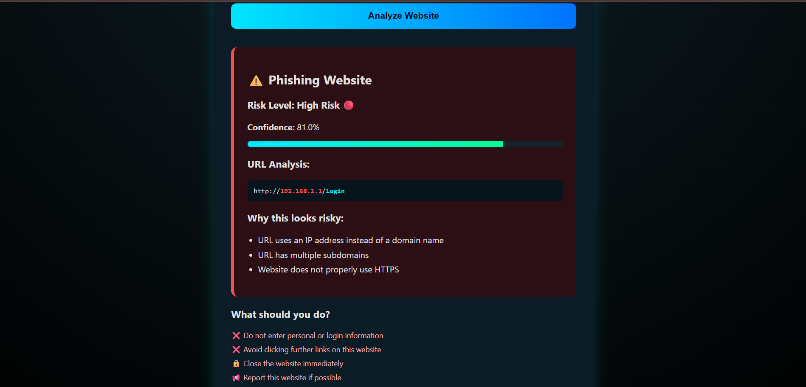

🔗 Live Demo: https://phishing-detector-7gfb.onrender.com


# Phishing Detector 🛡️
A machine learning–based web application that analyzes website URLs to detect potential phishing attempts.  
This project was built as a personal learning exercise and as my first individual cybersecurity project.

---

## Why I Built This Project
I built this phishing detector to practice my technical skills and learn more about cybersecurity concepts
The goal was not to build a production-grade security tool, but to understand how phishing detection works at a practical level using machine learning and web technologies.

---

## Features
- Detects phishing websites based on URL structure and lexical features  
- Machine learning–based classification  
- Risk level categorization (Low / Medium / High)  
- Confidence score for predictions  
- Explainable results showing why a URL looks risky  
- User-friendly web interface built with Flask  
- Clear safety guidance for users  

---

## How It Works
1. The user enters a website URL.  
2. The application extracts phishing-related features from the URL  
   (such as IP usage, suspicious keywords, HTTPS usage, and subdomain structure).  
3. These features are passed to a trained machine learning model.  
4. The model predicts whether the website is legitimate or phishing.  
5. The result is displayed along with:
   - Risk level  
   - Confidence score  
   - Explanation of detected suspicious patterns  

---

## Technologies Used
- Python  
- Flask  
- Scikit-learn  
- NumPy  
- HTML & CSS  

---

## How to Run the Project
1. Clone the repository:
   ```bash
   git clone https://github.com/your-username/phishing-detector.git
2. Navigate to the project directory:
    ```bash
    cd phishing-detector
3. Install dependencies:
    ```bash
    pip install -r requirements.txt
4. Run the application:
    ```bash
    python app.py
5. Open your browser and go to:
    http://127.0.0.1:5000

---

## Screenshots
### Legitimate Website Detection


### Phishing Website Detection


---

## Limitations
1. This project focuses only on URL-based analysis.
2. It does not analyze webpage content, email text, or attachments.
3. The model may not detect phishing websites hosted on compromised legitimate domains.
4. This project is intended for learning purposes, not real-world deployment.

---

## Future Improvements
1. Content-based phishing detection
2. Browser extension integration
3. Email phishing analysis
4. Model retraining with newer datasets